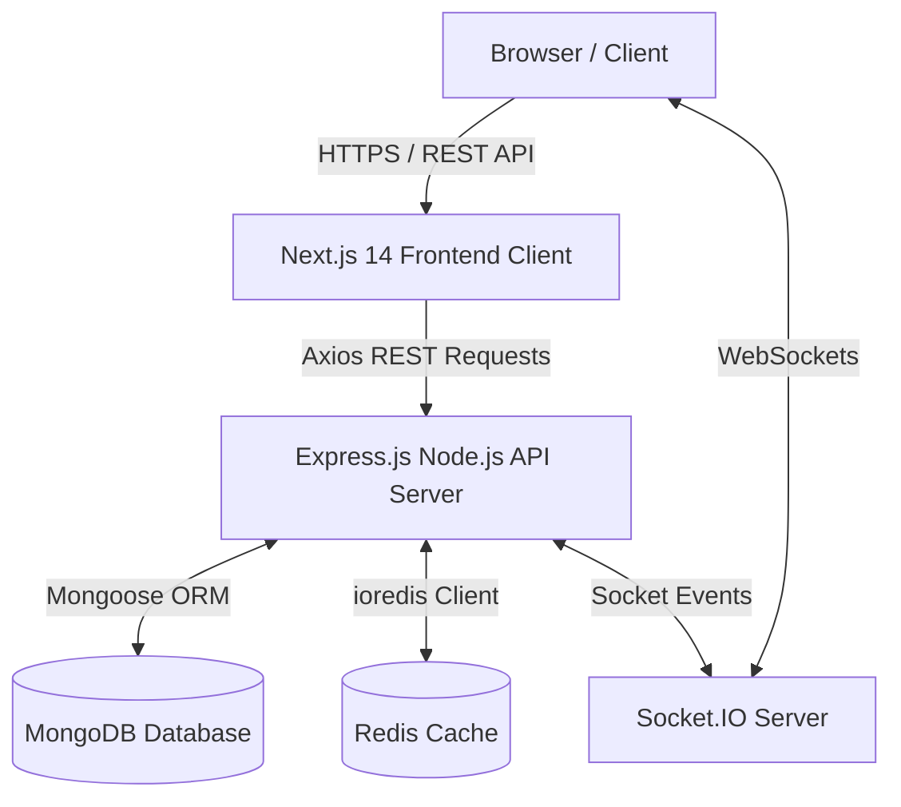

# TeamSync

TeamSync is a full-stack, real-time software project management and issue-tracking platform engineered for multi-tenant engineering teams.

## Overview

TeamSync provides a unified workspace for software teams to organize projects, track issues, assign tasks, collaborate in real time, and monitor workspace velocity. Users can manage multiple workspaces, invite team members with granular role-based permissions, track tasks on an interactive drag-and-drop Kanban board, stream live activity logs, receive instant notifications, and run global full-text queries across the entire workspace.

## Key Features

### Collaboration & Workspace Management
- **Multi-Tenant Workspaces**: Isolated environments with unique slugs, custom branding, and settings.
- **Invitation System**: Token-based email invitations with role pre-assignment and expiration tracking.
- **Workspace Switcher**: Instant context switching between multiple workspaces with local storage state persistence.

### Project & Task Management
- **Project Tracking**: Custom key prefixing (e.g. `CORE`, `IOS`), lead assignments, project archiving, and accent color customization.
- **Auto-Incrementing Issue Numbers**: Project-scoped unique issue keys (e.g., `SYNC-101`, `SYNC-102`).
- **Interactive Kanban Board**: Columns for `TODO`, `IN_PROGRESS`, `IN_REVIEW`, and `DONE` with 0ms optimistic UI updates and mid-point float rank positioning.
- **Task Metadata**: Status, priority levels (`URGENT`, `HIGH`, `MEDIUM`, `LOW`), labels, assignees, due dates, estimated hours, checklists, and subtasks.
- **Discussion Threads & `@mentions`**: Threaded task comments with automatic `@user.email` regex extraction triggering real-time notification alerts.
- **Activity Audit Trail**: Automated event log tracking creation, status updates, reassignments, priority changes, and comments.

### Authentication & Security
- **JWT Dual-Token Rotation**: Short-lived 15-minute access tokens paired with 7-day refresh tokens stored as bcrypt hashes in MongoDB.
- **Transparent Token Interceptor**: Axios interceptor queueing failed `401 Unauthorized` requests while executing token rotation in the background.
- **Password Security**: Hashing via `bcryptjs` (10 salt rounds), password change verification, reset tokens, and email verification workflows.
- **Role-Based Access Control (RBAC)**: Permission enforcement across `OWNER`, `ADMIN`, `MEMBER`, and `GUEST` roles.

### Real-Time & Search Engine
- **Socket.IO Engine**: Real-time room broadcasts (`project:<id>` and `user:<userId>`) for live Kanban updates and comment streaming.
- **Notification Center**: Real-time header unread notification badge counter and mark-as-read management.
- **Global Search & Command Palette (`Cmd+K`)**: Weighted MongoDB Text Indexes, 300ms debouncing, TanStack `useInfiniteQuery` cursor pagination, and 5-minute result caching.
- **Executive Analytics Dashboard**: Single-pass MongoDB aggregation pipelines computing task distribution, priority breakdown, project velocity %, and upcoming 7-day deadlines.

## Screenshots / Demo

- **Live Demo**: `[Link to live demo]` *(Add URL when deployed)*
- **Screenshots**: `[Add screenshots of Kanban Board, Dashboard, and Command Palette]`
- **Demo Video**: `[Link to video walkthrough]`

## Architecture



### Component Responsibilities
- **Next.js 14 Client**: Renders the dark-slate obsidian UI, manages local/server state via TanStack React Query v5, handles route protection, and listens for real-time WebSocket events.
- **Express.js API Server**: Enforces JWT authentication, RBAC authorization, Zod request validation, business logic execution, database queries, and Socket emission.
- **MongoDB**: Primary database storing users, workspaces, projects, tasks, comments, activities, and notifications with custom text indexes.
- **Redis**: Caching service for fast key-value retrieval with automated graceful fallback to in-memory handling when Redis is offline.

## Tech Stack

| Layer | Technology | Purpose |
|---|---|---|
| **Frontend** | Next.js 14 (App Router) | React Framework with Server/Client Components |
| **Language** | TypeScript | Static Type Safety across Client and Server |
| **State & Query** | TanStack React Query v5 | Server state management, caching, optimistic updates |
| **Styling** | Tailwind CSS | Utility-first CSS styling |
| **HTTP Client** | Axios | REST API requests with request/response interceptors |
| **Realtime Engine** | Socket.IO | Real-time WebSocket communication |
| **Backend Runtime** | Node.js / Express.js | REST API server framework |
| **Database** | MongoDB & Mongoose | Document-oriented database and ORM |
| **Cache** | Redis (`ioredis`) | In-memory key-value caching with fallback support |
| **Validation** | Zod | Runtime schema validation for forms and API requests |
| **Security** | `jsonwebtoken`, `bcryptjs` | JWT access/refresh token rotation & password hashing |

## How It Works

### User Authentication & Protected Request Flow
```
Client (Browser) ──────> POST /api/v1/auth/login ──────> Express API Server
                                                             │
                                                    Bcrypt Password Check
                                                             │
Client <────── JWT Access (15m) & Refresh Token (7d) <───────┘
  │
  ├── REST Request with `Authorization: Bearer <token>` ──> Protected API Route
  │                                                             │
  └── On 401 Unauthorized ──> Automatic POST /auth/refresh ─────┘
```

### Real-time Notification & Board Synchronization Flow
```
User A (Kanban Drag / Comment) ──> PATCH /api/v1/tasks/:id ──> Express API Server
                                                                   │
                                                          Save to MongoDB Database
                                                                   │
                                                          Emit Socket.IO Event
                                                                   │
                                                      ┌────────────┴────────────┐
                                                      ▼                         ▼
                                            Room: project:<id>        Room: user:<id>
                                                      │                         │
User B (Connected Teammate) <────── TASK_UPDATED Event ┘                         │
(React Query invalidates & updates board)                                      │
User C (Assigned User) <─────────── NOTIFICATION_RECEIVED ─────────────────────┘
(Unread badge counter increments live)
```

## Project Structure

```
TeamSync/
├── frontend/                   # Next.js 14 Application (Client)
│   ├── src/
│   │   ├── app/                # App router page routes
│   │   ├── components/         # Kanban, Dashboard, Modals, Tasks UI components
│   │   ├── hooks/              # Custom React Query and utility hooks
│   │   ├── lib/                # Axios instance and token manager
│   │   ├── providers/          # React Context providers (Auth, Query, Socket)
│   │   └── types/              # TypeScript interfaces
│   ├── package.json
│   └── README.md
├── backend/                    # Express.js REST API & Socket Server
│   ├── src/
│   │   ├── config/             # DB, Redis, and Socket.IO configuration
│   │   ├── controllers/        # Route controllers
│   │   ├── middlewares/        # Auth, RBAC, Zod, and error handling
│   │   ├── models/             # Mongoose schemas
│   │   ├── repositories/       # Database queries & aggregation pipelines
│   │   ├── routes/             # API routes
│   │   ├── services/           # Business logic & notification engines
│   │   └── validators/         # Zod schemas
│   ├── package.json
│   └── README.md
└── README.md                   # Root Documentation
```

## Local Development

### 1. Clone Repository
```bash
git clone https://github.com/your-username/TeamSync.git
cd TeamSync
```

### 2. Configure Backend Environment
```bash
cd backend
npm install
```
Create a `.env` file inside `backend/`:
```env
PORT=5000
NODE_ENV=development
MONGODB_URI=mongodb://127.0.0.1:27017/teamsync
REDIS_HOST=127.0.0.1
REDIS_PORT=6379
REDIS_PASSWORD=
JWT_ACCESS_SECRET=your_jwt_access_secret_key
JWT_REFRESH_SECRET=your_jwt_refresh_secret_key
JWT_ACCESS_EXPIRES_IN=15m
JWT_REFRESH_EXPIRES_IN=7d
CLIENT_URL=http://localhost:3000
```
Start the backend server:
```bash
npm run dev
```

### 3. Configure Frontend Environment
In a new terminal window:
```bash
cd frontend
npm install
```
Create a `.env.local` file inside `frontend/`:
```env
NEXT_PUBLIC_API_URL=http://localhost:5000/api/v1
NEXT_PUBLIC_SOCKET_URL=http://localhost:5000
```
Start the frontend client:
```bash
npm run dev
```

The web application will be running at `http://localhost:3000`.

## Environment Variables

### Client (`frontend/.env.local`)
```env
NEXT_PUBLIC_API_URL=
NEXT_PUBLIC_SOCKET_URL=
```

### Server (`backend/.env`)
```env
PORT=
NODE_ENV=
MONGODB_URI=
REDIS_HOST=
REDIS_PORT=
REDIS_PASSWORD=
JWT_ACCESS_SECRET=
JWT_REFRESH_SECRET=
JWT_ACCESS_EXPIRES_IN=
JWT_REFRESH_EXPIRES_IN=
CLIENT_URL=
SMTP_HOST=
SMTP_PORT=
SMTP_USER=
SMTP_PASS=
EMAIL_FROM=
GOOGLE_CLIENT_ID=
```

## Deployment

### Typical Deployment Setup
- **Frontend**: Deployed on **Vercel** pointing to the `frontend/` directory.
- **Backend API**: Deployed on **Render** / **Railway** or self-hosted Node.js server.
- **Database**: **MongoDB Atlas** cluster.
- **Cache**: **Upstash Redis** or managed Redis cloud instance.

## API Documentation

For detailed REST API specifications, payload schemas, and response examples, refer to the [Backend Documentation](file:///d:/teamSync/backend/README.md).

## Engineering Highlights

- **RBAC Enforcement**: Middleware hierarchy (`OWNER` > `ADMIN` > `MEMBER` > `GUEST`) checking compound workspace indices before route execution.
- **Real-Time Board Synchronization**: WebSockets triggering granular TanStack React Query invalidations without manual page refreshes.
- **Optimistic Drag-and-Drop Operations**: 0ms visual updates with automated rollback and mid-point float calculations avoiding database re-indexing.
- **MongoDB Aggregation Analytics**: Complex multi-facet pipelines calculating workspace project completion percentages and priority breakdowns in a single database round-trip.
- **Weighted Text Search**: Full-text search with relative scoring (`taskKey: 10`, `title: 5`) and client-side 300ms debouncing.

## Future Improvements

- [ ] Webhook integrations (GitHub PRs, Slack notifications)
- [ ] Exportable sprint reports (CSV, PDF)
- [ ] Custom task status workflows per project
- [ ] Native file attachments with AWS S3 / Cloudinary storage

## License

This project is licensed under the [MIT License](LICENSE).

## Author

- **GitHub**: `[https://github.com/your-username]` *(Add your GitHub profile URL)*
- **LinkedIn**: `[https://linkedin.com/in/your-profile]` *(Add your LinkedIn profile URL)*
- **Portfolio**: `[https://your-portfolio.com]` *(Add your portfolio URL)*
