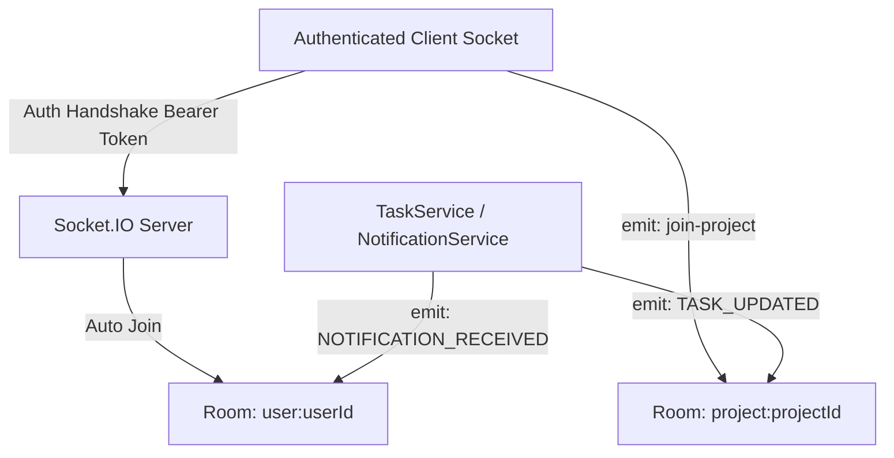

# TeamSync Backend

The backend for TeamSync is an Express REST API and Socket.IO server written in **TypeScript** and powered by **MongoDB**, **Mongoose**, and **Redis**.

## Responsibilities

- **REST APIs**: Provides endpoints for authentication, workspace management, project creation, task workflows, discussions, activity logs, executive analytics, and global search.
- **Authentication**: JWT access and refresh token rotation with bcrypt password security and email verification flows.
- **Authorization**: Workspace isolation and hierarchical Role-Based Access Control (`OWNER`, `ADMIN`, `MEMBER`, `GUEST`).
- **Database Operations**: Schema modeling, compound indexing, text search indexing, and multi-facet aggregation pipelines via Mongoose.
- **Real-Time Communication**: WebSocket server managing room subscriptions (`project:<id>` and `user:<id>`) and live event broadcasting.
- **Notifications**: Automated real-time alerts for task assignments, updates, comment additions, and `@mention` events.
- **Caching**: Redis key-value caching with automated graceful in-memory fallback.

## Tech Stack

| Technology | Purpose |
|---|---|
| **Node.js & Express.js** | Backend server runtime and REST API web framework |
| **TypeScript** | Static typing across routes, controllers, services, and repositories |
| **MongoDB & Mongoose** | Document database and object data modeling (ODM) |
| **Redis (`ioredis`)** | In-memory key-value caching with graceful fallback handling |
| **Socket.IO Server** | WebSocket server engine for real-time room communication |
| **`jsonwebtoken`** | Sign and verify JWT access and refresh tokens |
| **`bcryptjs`** | Password hashing (10 salt rounds) and token hash comparison |
| **Zod** | Schema validation for HTTP payload requests |

## Architecture

Request Execution Pipeline:
```
Client Request
      │
      ▼
Express Route (`src/routes/`)
      │
      ▼
Middlewares (`src/middlewares/`) ──► Auth Guard (`authenticate`)
      │                          ──► RBAC Guard (`requireWorkspaceRole`)
      │                          ──► Zod Payload Validator (`validateRequest`)
      ▼
Controller Handler (`src/controllers/`)
      │
      ▼
Service Layer (`src/services/`) ─────► Business Logic & Socket Emissions
      │
      ▼
Repository Layer (`src/repositories/`) ──► MongoDB / Mongoose Queries
      │
      ▼
Response Utility (`src/utils/response.ts`) ──► JSON Response Format
```

## Folder Structure

```
backend/
├── src/
│   ├── config/                           # Application Configuration
│   │   ├── database.ts                   # MongoDB connection manager
│   │   ├── env.ts                        # Zod environment variable parser
│   │   ├── redis.ts                      # Redis client with fallback strategy
│   │   └── socket.ts                     # Socket.IO server initialization & JWT auth
│   ├── constants/                        # Enums (WorkspaceRole, TaskStatus, TaskPriority)
│   ├── controllers/                      # HTTP Request Controllers
│   │   ├── auth.controller.ts
│   │   ├── dashboard.controller.ts
│   │   ├── notification.controller.ts
│   │   ├── project.controller.ts
│   │   ├── search.controller.ts
│   │   ├── task.controller.ts
│   │   └── workspace.controller.ts
│   ├── errors/                           # Custom AppError classes
│   ├── middlewares/                      # Auth, RBAC, Zod, and Error Handling Middlewares
│   │   ├── auth.middleware.ts            # JWT authentication guard
│   │   ├── error.middleware.ts           # Centralized Express error handler
│   │   ├── rbac.middleware.ts            # Role hierarchy enforcement middleware
│   │   └── validate.middleware.ts        # Zod request validation middleware
│   ├── models/                           # Mongoose Schemas & Models
│   │   ├── activity.model.ts             # Task audit logs
│   │   ├── comment.model.ts              # Task discussion comments
│   │   ├── notification.model.ts         # User notifications
│   │   ├── project.model.ts              # Workspace projects
│   │   ├── task.model.ts                 # Tasks, checklists, and subtasks
│   │   ├── user.model.ts                 # User accounts & auth tokens
│   │   ├── workspace-invite.model.ts     # Email invitation tokens
│   │   ├── workspace-member.model.ts     # Workspace membership & roles
│   │   └── workspace.model.ts            # Workspaces
│   ├── repositories/                     # Database Access Layer
│   │   ├── dashboard.repository.ts       # Aggregation pipelines
│   │   ├── project.repository.ts
│   │   ├── search.repository.ts          # Weighted text search queries
│   │   ├── task.repository.ts
│   │   ├── user.repository.ts
│   │   └── workspace.repository.ts
│   ├── routes/                           # Express Route Definitions
│   │   ├── auth.routes.ts
│   │   ├── dashboard.routes.ts
│   │   ├── index.ts                      # Main API router mounting all routes
│   │   ├── notification.routes.ts
│   │   ├── project.routes.ts
│   │   ├── search.routes.ts
│   │   ├── task.routes.ts
│   │   └── workspace.routes.ts
│   ├── services/                         # Business Logic & Notification Engine
│   │   ├── auth.service.ts
│   │   ├── dashboard.service.ts
│   │   ├── notification.service.ts
│   │   ├── project.service.ts
│   │   ├── search.service.ts
│   │   ├── socket.service.ts
│   │   ├── task.service.ts
│   │   └── workspace.service.ts
│   ├── utils/                            # Email, JWT, response formatters
│   ├── validators/                       # Zod Validation Schemas
│   ├── app.ts                            # Express application setup
│   └── server.ts                         # Server entrypoint & Socket binding
├── package.json
└── tsconfig.json
```

## Authentication

- **User Registration**: `POST /api/v1/auth/register` hashes password via `bcryptjs` (10 rounds) and generates verification tokens.
- **User Login**: `POST /api/v1/auth/login` verifies credentials and issues short-lived Access Token (15m) and long-lived Refresh Token (7d).
- **Token Storage**: Refresh token is hashed with bcrypt and saved in the user's MongoDB record (`refreshTokenHash`).
- **Token Refresh**: `POST /api/v1/auth/refresh` verifies incoming refresh token against the stored hash and issues rotated token pairs.
- **Logout**: `POST /api/v1/auth/logout` sets `refreshTokenHash` to `null` in MongoDB.
- **Route Guard**: `authenticate` middleware extracts `Bearer <token>` from HTTP headers, decodes JWT, and attaches `req.user` payload.

## Authorization / RBAC

Workspace permissions are governed by `requireWorkspaceRole(requiredRole)` middleware:

| Role | Hierarchy Level | Capabilities |
|---|:---:|---|
| **`OWNER`** | 4 | Workspace deletion, role promotions, member management, project & task control |
| **`ADMIN`** | 3 | Member invitations, workspace settings, project creation, task management |
| **`MEMBER`** | 2 | Project viewing, task creation, status updates, comment threads |
| **`GUEST`** | 1 | Read-only access to assigned projects and tasks |

Permissions are evaluated dynamically against compound unique indexes on `WorkspaceMember` (`{ workspaceId: 1, userId: 1 }`).

## Database Models & Indexing

1. **`User`** ([`src/models/user.model.ts`](file:///d:/teamSync/backend/src/models/user.model.ts)): User accounts. Text index on `{ name: "text", email: "text" }`.
2. **`Workspace`** ([`src/models/workspace.model.ts`](file:///d:/teamSync/backend/src/models/workspace.model.ts)): Workspace organizations. Unique index on `slug`.
3. **`WorkspaceMember`** ([`src/models/workspace-member.model.ts`](file:///d:/teamSync/backend/src/models/workspace-member.model.ts)): Connects User and Workspace with a `role`. Compound unique index on `{ workspaceId: 1, userId: 1 }`.
4. **`WorkspaceInvite`** ([`src/models/workspace-invite.model.ts`](file:///d:/teamSync/backend/src/models/workspace-invite.model.ts)): Email invite tokens with expiration dates.
5. **`Project`** ([`src/models/project.model.ts`](file:///d:/teamSync/backend/src/models/project.model.ts)): Projects within a workspace. Compound unique index on `{ workspaceId: 1, key: 1 }`. Text index on `{ key: "text", name: "text", description: "text" }`.
6. **`Task`** ([`src/models/task.model.ts`](file:///d:/teamSync/backend/src/models/task.model.ts)): Tasks, checklists, subtasks. Compound unique index on `{ projectId: 1, taskNumber: 1 }`. Text index on `{ taskKey: "text", title: "text", labels: "text", description: "text" }`.
7. **`Comment`** ([`src/models/comment.model.ts`](file:///d:/teamSync/backend/src/models/comment.model.ts)): Task discussion comments. Text index on `{ content: "text" }`.
8. **`ActivityLog`** ([`src/models/activity.model.ts`](file:///d:/teamSync/backend/src/models/activity.model.ts)): Audit timeline records.
9. **`Notification`** ([`src/models/notification.model.ts`](file:///d:/teamSync/backend/src/models/notification.model.ts)): In-app alerts with `isRead` tracking.

## API Endpoints

### Authentication (`/api/v1/auth`)
| Method | Endpoint | Description | Auth |
|---|---|---|:---:|
| `POST` | `/api/v1/auth/register` | Register new user account | No |
| `POST` | `/api/v1/auth/login` | Authenticate user & issue tokens | No |
| `POST` | `/api/v1/auth/refresh` | Rotate access and refresh tokens | No |
| `POST` | `/api/v1/auth/logout` | Revoke user refresh token | Yes |
| `GET` | `/api/v1/auth/me` | Fetch authenticated user profile | Yes |
| `PATCH` | `/api/v1/auth/me/profile` | Update name, avatarUrl, bio | Yes |
| `PATCH` | `/api/v1/auth/me/password` | Change password with current verification | Yes |
| `PATCH` | `/api/v1/auth/me/notifications` | Update notification preferences | Yes |
| `DELETE` | `/api/v1/auth/me` | Delete user account | Yes |

### Workspaces (`/api/v1/workspaces`)
| Method | Endpoint | Description | Required Role |
|---|---|---|:---:|
| `POST` | `/api/v1/workspaces` | Create new workspace | Authenticated |
| `GET` | `/api/v1/workspaces` | Fetch user's workspaces | Authenticated |
| `GET` | `/api/v1/workspaces/:workspaceId` | Fetch workspace details | `GUEST`+ |
| `GET` | `/api/v1/workspaces/:workspaceId/dashboard` | Fetch executive dashboard analytics | `GUEST`+ |
| `GET` | `/api/v1/workspaces/:workspaceId/search` | Execute multi-entity global search | `GUEST`+ |
| `PATCH` | `/api/v1/workspaces/:workspaceId` | Update workspace settings | `ADMIN`+ |
| `DELETE` | `/api/v1/workspaces/:workspaceId` | Delete workspace | `OWNER` |
| `GET` | `/api/v1/workspaces/:workspaceId/members` | Fetch workspace members | `GUEST`+ |
| `POST` | `/api/v1/workspaces/:workspaceId/invites` | Send workspace invitation | `ADMIN`+ |
| `POST` | `/api/v1/workspaces/accept-invite` | Accept workspace invite token | Authenticated |
| `PATCH` | `/api/v1/workspaces/:workspaceId/members/:userId` | Update member role | `ADMIN`+ |
| `DELETE` | `/api/v1/workspaces/:workspaceId/members/:userId` | Remove member from workspace | `MEMBER`+ |

### Projects (`/api/v1/projects` & `/api/v1/workspaces/:workspaceId/projects`)
| Method | Endpoint | Description | Required Role |
|---|---|---|:---:|
| `POST` | `/api/v1/workspaces/:workspaceId/projects` | Create new project with auto-key | `ADMIN`+ |
| `GET` | `/api/v1/workspaces/:workspaceId/projects` | Fetch workspace projects | `GUEST`+ |
| `GET` | `/api/v1/projects/:projectId` | Fetch project details | Authenticated |
| `PATCH` | `/api/v1/projects/:projectId` | Update project attributes | Authenticated |
| `DELETE` | `/api/v1/projects/:projectId` | Delete project | Authenticated |

### Tasks (`/api/v1/tasks` & `/api/v1/projects/:projectId/tasks`)
| Method | Endpoint | Description | Auth |
|---|---|---|:---:|
| `POST` | `/api/v1/projects/:projectId/tasks` | Create task with auto-increment number | Yes |
| `GET` | `/api/v1/projects/:projectId/tasks` | Fetch project tasks with filters | Yes |
| `GET` | `/api/v1/tasks/:taskId` | Fetch task details with populated users | Yes |
| `PATCH` | `/api/v1/tasks/:taskId` | Update task status, priority, rank position | Yes |
| `DELETE` | `/api/v1/tasks/:taskId` | Delete task | Yes |
| `POST` | `/api/v1/tasks/:taskId/comments` | Add comment thread entry with @mentions | Yes |
| `GET` | `/api/v1/tasks/:taskId/comments` | Fetch task comments | Yes |
| `GET` | `/api/v1/tasks/:taskId/activities` | Fetch task audit activity timeline | Yes |

### Notifications (`/api/v1/notifications`)
| Method | Endpoint | Description | Auth |
|---|---|---|:---:|
| `GET` | `/api/v1/notifications` | Fetch user notifications | Yes |
| `GET` | `/api/v1/notifications/unread-count` | Fetch count of unread notifications | Yes |
| `PATCH` | `/api/v1/notifications/read-all` | Mark all notifications as read | Yes |
| `PATCH` | `/api/v1/notifications/:notificationId/read` | Mark single notification as read | Yes |

## Request / Response Examples

### Register Account (`POST /api/v1/auth/register`)
**Request Body**:
```json
{
  "name": "Alex Rivera",
  "email": "alex@teamsync.app",
  "password": "Password123"
}
```
**Response (201 Created)**:
```json
{
  "success": true,
  "message": "Registration successful. Please verify your email.",
  "data": {
    "user": {
      "id": "66b2a1e4f912c4001a89012a",
      "name": "Alex Rivera",
      "email": "alex@teamsync.app",
      "isEmailVerified": false
    },
    "accessToken": "eyJhbGciOiJIUzI1NiIsInR5cCI6...",
    "refreshToken": "eyJhbGciOiJIUzI1NiIsInR5cCI6..."
  }
}
```

### Create Task (`POST /api/v1/projects/:projectId/tasks`)
**Request Body**:
```json
{
  "title": "Build WebSockets notification engine",
  "description": "Stream live task assignment alerts over Socket.IO",
  "status": "TODO",
  "priority": "HIGH",
  "labels": ["backend", "sockets"],
  "estimatedTime": 8
}
```
**Response (201 Created)**:
```json
{
  "success": true,
  "message": "Task created successfully",
  "data": {
    "_id": "66b2a2f8f912c4001a89014b",
    "taskNumber": 12,
    "taskKey": "CORE-12",
    "title": "Build WebSockets notification engine",
    "status": "TODO",
    "priority": "HIGH"
  }
}
```

## Real-Time Communication



### WebSocket Events
- **`join-project`** `(projectId: string)`: Subscribes socket to room `project:<projectId>`.
- **`leave-project`** `(projectId: string)`: Unsubscribes socket from room `project:<projectId>`.
- **`TASK_UPDATED`** `(payload: Task)`: Broadcast to `project:<projectId>` when status, priority, or details mutate.
- **`COMMENT_ADDED`** `(payload: { taskId, comment })`: Broadcast to `project:<projectId>`.
- **`NOTIFICATION_RECEIVED`** `(payload: Notification)`: Dispatched to target `user:<userId>` room when assigned to a task or `@mentioned`.

## Redis Caching

Managed via `RedisService` ([`src/config/redis.ts`](file:///d:/teamSync/backend/src/config/redis.ts)):
- Connects using `ioredis` client (`REDIS_HOST`, `REDIS_PORT`, `REDIS_PASSWORD`).
- **Graceful Offline Fallback**: Configured with `maxRetriesPerRequest: 1`. If a Redis instance is not detected, the application automatically switches to in-memory handling and logs:
  `ℹ️ Redis server not detected. App operating cleanly with in-memory storage fallback.`

## Error Handling

Centralized error handling via `errorMiddleware` ([`src/middlewares/error.middleware.ts`](file:///d:/teamSync/backend/src/middlewares/error.middleware.ts)):
- **`AppError`**: Base error class extending standard `Error`.
- **Derived Errors**: `BadRequestError` (400), `UnauthorizedError` (401), `ForbiddenError` (403), `NotFoundError` (404), `ConflictError` (409).
- Returns normalized JSON response format:
```json
{
  "success": false,
  "message": "Error description message"
}
```

## Security Implementation

- **Password Security**: Passwords hashed using `bcryptjs` with 10 salt rounds.
- **JWT Protection**: Short-lived 15-minute access tokens and 7-day refresh tokens stored as bcrypt hashes in MongoDB.
- **CORS Configuration**: Configured with strict origin matching (`CLIENT_URL`) and `credentials: true`.
- **Input Validation**: All incoming API requests validated against strict Zod schemas via `validateRequest` middleware.
- **Database Safety**: Compound unique index constraints prevent duplicate memberships and key collisons.

## Environment Variables

Configure environment variables in `backend/.env`:

```env
PORT=5000
NODE_ENV=development

MONGODB_URI=mongodb://127.0.0.1:27017/teamsync

REDIS_HOST=127.0.0.1
REDIS_PORT=6379
REDIS_PASSWORD=

JWT_ACCESS_SECRET=your_jwt_access_secret
JWT_REFRESH_SECRET=your_jwt_refresh_secret
JWT_ACCESS_EXPIRES_IN=15m
JWT_REFRESH_EXPIRES_IN=7d

CLIENT_URL=http://localhost:3000

SMTP_HOST=smtp.mailtrap.io
SMTP_PORT=2525
SMTP_USER=test
SMTP_PASS=test
EMAIL_FROM="TeamSync Security <no-reply@teamsync.app>"

GOOGLE_CLIENT_ID=mock_google_client_id
```

## Installation

```bash
# Install dependencies
npm install
```

## Development

```bash
# Run development server with live reload (ts-node-dev)
npm run dev
```
The API server runs at `http://localhost:5000/api/v1`.

## Production

```bash
# Compile TypeScript to dist/ directory
npm run build

# Start production server from dist/server.js
npm start
```

Static type check command:
```bash
node node_modules/typescript/bin/tsc --noEmit
```
Returns **0 errors**.

## API Testing

API routes can be tested using Postman, Insomnia, or cURL.
Example cURL request:

```bash
curl -X POST http://localhost:5000/api/v1/auth/login \
  -H "Content-Type: application/json" \
  -d '{"email": "user@example.com", "password": "Password123"}'
```

## Troubleshooting

- **MongoDB Connection Error**: Check if MongoDB service is started locally or if IP address is whitelisted on MongoDB Atlas.
- **JWT Unauthorized Errors**: Ensure `JWT_ACCESS_SECRET` matches across initial token generation and verification middleware.
- **Redis Connection Warning**: If Redis is offline, the app displays a fallback warning but functions cleanly without breaking.

## Related Documentation

- [Root README](../README.md)
- [Frontend README](../frontend/README.md)
