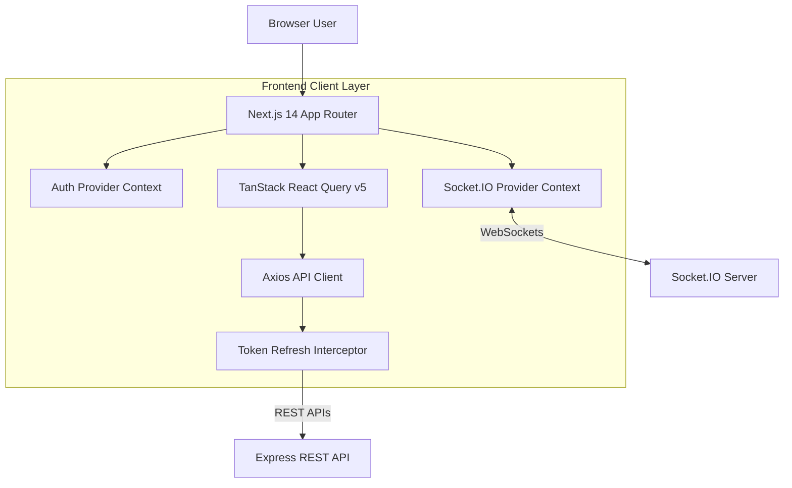

# TeamSync Frontend

The frontend for TeamSync is a client web application built with **Next.js 14 (App Router)**, **TypeScript**, **Tailwind CSS**, **TanStack React Query v5**, and **Socket.IO Client**.

## Responsibilities

- **User Interface**: Renders a dark-slate obsidian UI modeled after Linear and GitHub Projects.
- **Routing**: Next.js App Router route management, layouts, and route guards.
- **Authentication State**: Client-side session management, JWT access token storage, and refresh token interceptors.
- **API Communication**: Axios REST API integration with automatic token queueing and response error normalization.
- **Server State Management**: TanStack React Query cache management, background refetching, and optimistic updates.
- **Form Handling & Validation**: Controlled forms using React Hook Form and Zod client schemas.
- **Real-Time Communication**: WebSocket connection management and event-driven cache invalidation.

## Tech Stack

| Technology | Purpose |
|---|---|
| **Next.js 14** | React Framework utilizing App Router and Server/Client Components |
| **TypeScript** | Static typing for components, props, hooks, and API responses |
| **TanStack React Query v5** | Server state fetching, caching, optimistic mutations, and cache invalidation |
| **Tailwind CSS** | Utility-first styling framework |
| **Axios** | HTTP client configured with request/response interceptors |
| **Socket.IO Client** | Real-time WebSocket connection to backend socket server |
| **React Hook Form & Zod** | Form state management and schema validation |
| **Lucide React** | Scalable UI icons |

## Features

- **Auth Pages**: Sign In (`/login`), Sign Up (`/register`), Forgot Password (`/forgot-password`), Reset Password (`/reset-password`), Email Verification (`/verify-email`).
- **Workspace Switcher**: Top navbar dropdown for instant workspace context switching with local storage memory.
- **Optimistic Kanban Board**: Columns (`TODO`, `IN_PROGRESS`, `IN_REVIEW`, `DONE`) with 0ms drag-and-drop updates, keyboard navigation, and side-drawer task detail editor.
- **Command Palette (`Cmd+K`)**: Universal search modal with 300ms debouncing, infinite scroll pagination, and category filtering.
- **Notification Panel**: Header bell dropdown displaying unread notifications and real-time unread badge counter.
- **Executive Analytics Dashboard**: Overview cards, clean SVG breakdown charts, project completion progress meters, and upcoming deadlines.
- **Unified Settings Module**: User profile management, password change with strength indicators, notification preferences, team member RBAC management, and red danger zone actions.

## Architecture



## Folder Structure

```
frontend/
├── src/
│   ├── app/                              # Next.js 14 App Router Page Directory
│   │   ├── (auth)/                       # Auth routes (login, register, forgot-password, reset-password, verify-email)
│   │   └── (dashboard)/                  # Dashboard routes (workspaces, projects, board, dashboard, settings)
│   ├── components/                       # UI Component Modules
│   │   ├── common/                       # Status badges, workspace switcher, notification panel, search modal
│   │   ├── dashboard/                    # Overview cards, distribution charts, progress meters
│   │   ├── kanban/                       # KanbanBoard, KanbanColumn, KanbanCard, BoardFilterBar
│   │   ├── modals/                       # Create Workspace, Create Project, Invite Member modals
│   │   ├── projects/                     # Project cards and settings components
│   │   ├── settings/                     # Settings tabs, profile form, password form, notification form, danger zone
│   │   ├── tasks/                        # TaskDetailDrawer, CreateTaskModal, comment thread, activity feed
│   │   └── ui/                           # Reusable primitive UI tokens (Button, Input, Alert, Card)
│   ├── hooks/                            # Custom React Hooks
│   │   ├── use-auth.ts                   # Session state access
│   │   ├── use-dashboard.ts              # Dashboard analytics query
│   │   ├── use-debounce.ts               # Input debouncer (300ms)
│   │   ├── use-global-search.ts          # Infinite query search hook
│   │   ├── use-notifications.ts          # Notification queries and mutations
│   │   ├── use-projects.ts               # Project CRUD queries and mutations
│   │   ├── use-socket.ts                 # Socket context access
│   │   ├── use-tasks.ts                  # Task CRUD, comment, and activity hooks
│   │   └── use-workspaces.ts             # Workspace CRUD and member hooks
│   ├── lib/                              # Core Utility Modules
│   │   ├── api-client.ts                 # Axios instance & 401 token queueing interceptor
│   │   ├── token.ts                      # LocalStorage & in-memory JWT manager
│   │   └── utils.ts                      # Tailwind class helper (clsx + tailwind-merge)
│   ├── providers/                        # Global React Providers
│   │   ├── auth-provider.tsx             # User authentication context provider
│   │   ├── query-provider.tsx            # TanStack React Query client provider
│   │   └── socket-provider.tsx           # WebSocket provider & cache invalidation listener
│   └── types/                            # TypeScript Data Interfaces & DTO Specifications
├── package.json
└── tsconfig.json
```

## Authentication

- **Registration & Login**: Credentials submitted via `apiClient.post("/auth/login")`. Access and refresh tokens returned and saved using `tokenManager`.
- **Token Management**: Access token stored in memory/storage; attached to outgoing HTTP requests in header `Authorization: Bearer <accessToken>`.
- **Protected Routes**: Encapsulated by `ProtectedRoute` wrapper component checking authentication state; redirects unauthenticated users to `/login`.
- **Refresh Token Interceptor**: On HTTP `401 Unauthorized`, Axios interceptor pauses queued requests, dispatches `/auth/refresh`, updates tokens, and retries original requests seamlessly.
- **Logout**: Dispatches `POST /auth/logout`, purges stored tokens, disconnects socket, and redirects user to `/login`.

## API Integration

- **Base URL Configuration**: Configured via `process.env.NEXT_PUBLIC_API_URL` (default: `http://localhost:5000/api/v1`).
- **Axios Instance** ([`src/lib/api-client.ts`](file:///d:/teamSync/frontend/src/lib/api-client.ts)): Centralized HTTP client configured with `withCredentials: true`.
- **React Query Hooks**: Data fetching hooks use TanStack React Query for caching, polling, background revalidation, and mutation management.

## State Management

- **Local UI State**: Managed via standard `useState` and `useReducer` inside individual components (e.g. modal visibility, form inputs, active tab).
- **Server State**: Managed via **TanStack React Query v5** (`useQuery`, `useMutation`, `useInfiniteQuery`). Controls caching, query invalidation, and optimistic mutations.
- **Global Context State**:
  - `AuthProvider`: Stores current user profile, authentication status, and session handlers.
  - `SocketProvider`: Stores WebSocket connection state and manages global realtime socket listeners.

## Real-Time Communication

- **Connection Lifecycle**: `SocketProvider` initializes a Socket.IO client connection when authenticated, passing JWT access token in handshake `auth.token`.
- **Room Management**: Custom methods `joinProject(projectId)` and `leaveProject(projectId)` subscribe the client socket to specific project channels.
- **UI Reaction to Socket Events**:
  - `TASK_UPDATED` / `TASK_DELETED`: Triggers `queryClient.invalidateQueries({ queryKey: ["tasks"] })`, refreshing Kanban board cards automatically.
  - `COMMENT_ADDED`: Invalidates `["task-comments"]` and `["task-activities"]`.
  - `NOTIFICATION_RECEIVED`: Invalidates `["notifications"]` and `["unread-count"]`, updating the header unread badge counter instantly.

## Environment Variables

Configure environment variables in `frontend/.env.local`:

```env
NEXT_PUBLIC_API_URL=http://localhost:5000/api/v1
NEXT_PUBLIC_SOCKET_URL=http://localhost:5000
```

## Installation

```bash
# Install dependencies
npm install

# Start development server
npm run dev
```

## Production Build

```bash
# Generate optimized production build
npm run build

# Start production server
npm start
```

Static type safety can be verified prior to build using:
```bash
node node_modules/typescript/bin/tsc --noEmit
```

## Deployment

### Vercel Deployment Setup
1. Import the root repository into Vercel and set the **Root Directory** to `frontend`.
2. Configure Environment Variables in the Vercel Dashboard:
   - `NEXT_PUBLIC_API_URL` = `https://your-backend-api.com/api/v1`
   - `NEXT_PUBLIC_SOCKET_URL` = `https://your-backend-api.com`
3. Deploy.

## UI / Design

- **Design Aesthetic**: Linear-style obsidian slate dark theme (`#0b0f17` background, `#161b26` surface cards, `#1f293d` borders).
- **Typography & Components**: Clean typography, low-contrast subtle borders, custom scrollbars, and standardized badges for status and priority metrics.
- **Visual Design Philosophy**: High information density, minimal clutter, zero unnecessary decorative animations, and keyboard-first accessibility.

## Troubleshooting

- **CORS Errors**: Verify `NEXT_PUBLIC_API_URL` matches the backend host and backend `CLIENT_URL` environment variable matches `http://localhost:3000`.
- **WebSocket Disconnections**: Ensure backend server is running and `NEXT_PUBLIC_SOCKET_URL` points to the base host (excluding `/api/v1` suffix).
- **401 Token Refresh Loop**: Check if refresh token has expired or if backend Redis/DB storage cleared stored user refresh token hash.

## Related Documentation

- [Root README](../README.md)
- [Backend README](../backend/README.md)
